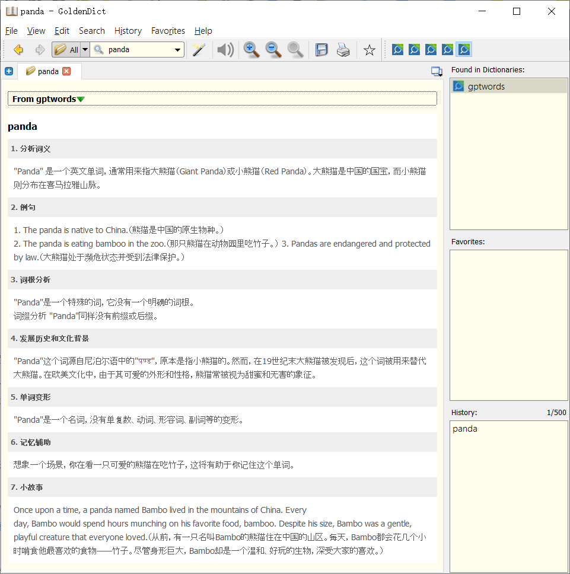

## 简介
该项目数据来源于`Ceelog/DictionaryByGPT4`开源项目中的JSON数据, 通过格式化后转为MDX文件, 供GoldenDict字典使用

## 词库源
词库来源
[Ceelog/DictionaryByGPT4](https://github.com/Ceelog/DictionaryByGPT4)

## 文件下载
- [格式化后的json文件 (gptwords_formatted.json)](https://github.com/PandaCatLabs/GPTDictMDX/blob/main/out/gptwords_formatted.json)
- [mdx源文件 (gptwords.txt)](https://github.com/PandaCatLabs/GPTDictMDX/blob/main/out/gptwords.txt)
- [mdx文件 (gptwords.mdx)](https://github.com/PandaCatLabs/GPTDictMDX/blob/main/out/gptwords.mdx)

## 生成 mdx
```js
node index [json|mdx]
```

## 截图



## 鸣谢
感谢 Ceelog/DictionaryByGPT4 开源项目